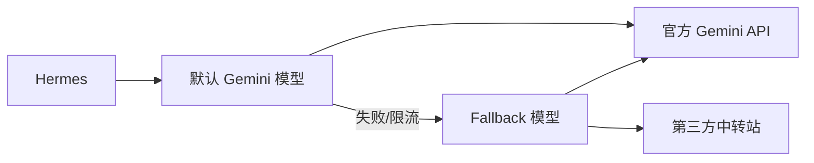

Gemini API 目前提供免费层，对个人日常折腾、脚本自动化和接入智能体系统（如 Hermes）都很适合。不过需要先说清楚：不是所有 Gemini 模型都能免费用，免费层也会有请求频率和每日请求量限制。

这篇只总结三件事：**接入 Gemini**、**配置多模型回退**、**接入第三方中转站**。Hermes 的核心配置写在 `~/.hermes/config.yaml`，不要套用其他版本的 `providers.custom`、`main_model`、`fallback_model` 写法。



## 1. 接入 Gemini

先去 [Google AI Studio](https://aistudio.google.com/) 创建 API Key。然后用你习惯的编辑器打开 Hermes 配置文件，例如：

```bash
code ~/.hermes/config.yaml
```

如果直接走 Google Gemini 官方接口，可以这样写：

```yaml
model:
  default: gemini-3-flash-preview
  provider: gemini
  base_url: https://generativelanguage.googleapis.com/v1beta
providers: {}
```

这三项是关键：

- `default`：默认模型名。
- `provider`：这里写 `gemini`。
- `base_url`：官方 Gemini API 地址。

如果你的账号确认可用 `gemini-3.1-pro-preview`，也可以把 `default` 改成它；如果只想优先使用免费层，更建议默认用 `gemini-3-flash-preview`。

## 2. 多模型回退机制

免费层容易遇到限流，或者某个模型临时不可用。`fallback_providers` 可以让 Hermes 在默认模型失败时自动尝试备用模型。

```yaml
fallback_providers:
  - provider: gemini
    model: gemini-3.1-flash-lite-preview
    base_url: https://generativelanguage.googleapis.com/v1beta
```

也可以把完整配置放在一起：

```yaml
model:
  default: gemini-3-flash-preview
  provider: gemini
  base_url: https://generativelanguage.googleapis.com/v1beta
providers: {}

fallback_providers:
  - provider: gemini
    model: gemini-3.1-flash-lite-preview
    base_url: https://generativelanguage.googleapis.com/v1beta
```

这样就是：默认走 `gemini-3-flash-preview`，失败后回退到 `gemini-3.1-flash-lite-preview`。

## 3. 接入第三方中转站

接入中转站的核心就是改 `base_url`。中转站一般分两种。

如果中转站兼容 Gemini 原生接口，通常还是 `/v1beta`，`provider` 继续写 `gemini`：

```yaml
model:
  default: gemini-3-flash-preview
  provider: gemini
  base_url: https://api.your-proxy-domain.com/v1beta
providers: {}

fallback_providers:
  - provider: gemini
    model: gemini-3.1-flash-lite-preview
    base_url: https://api.your-proxy-domain.com/v1beta
```

如果中转站是 OpenAI-compatible 接口，通常是 `/v1`，`provider` 要写 `openai`，模型名以中转站后台显示为准：

```yaml
model:
  default: gemini-3-flash-preview
  provider: openai
  base_url: https://api.your-proxy-domain.com/v1
providers: {}

fallback_providers:
  - provider: openai
    model: gemini-3.1-flash-lite-preview
    base_url: https://api.your-proxy-domain.com/v1
```

也可以默认走官方 Gemini，失败后再走中转站：

```yaml
model:
  default: gemini-3-flash-preview
  provider: gemini
  base_url: https://generativelanguage.googleapis.com/v1beta
providers: {}

fallback_providers:
  # 官方 Gemini 原生接口
  - provider: gemini
    model: gemini-3.1-flash-lite-preview
    base_url: https://generativelanguage.googleapis.com/v1beta

  # OpenAI-compatible 中转站
  - provider: openai
    model: gemini-3-flash-preview
    base_url: https://api.your-proxy-domain.com/v1
```

## 总结

这套配置就三层：默认模型负责日常请求，`fallback_providers` 负责兜底，中转站通过 `base_url` 接入。记住 `provider` 和接口格式要对应：Gemini 原生接口用 `gemini`，OpenAI-compatible 接口用 `openai`。
